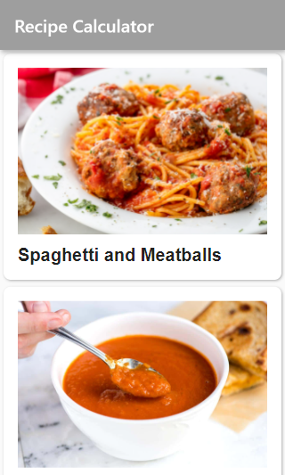
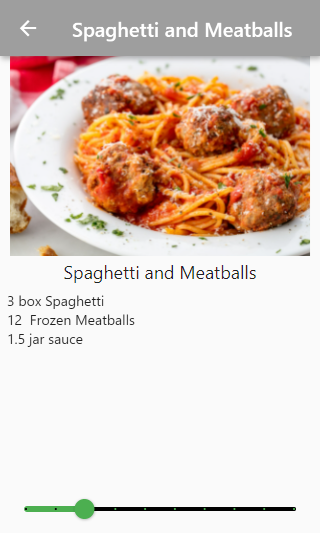

# Recipes_App

A simple and lightweight Flutter app to show the recipe for some meals, using ListView, and to recalculate quantities based on the number of servings using Slider.
 
### Some Screenshots

<h2>Home Page</h2>

 
<h2>Recipe Detail</h2>

## Getting Started

For help getting started with Flutter, view our
[online documentation](https://flutter.dev/docs), which offers tutorials,
samples, guidance on mobile development, and a full API reference.
